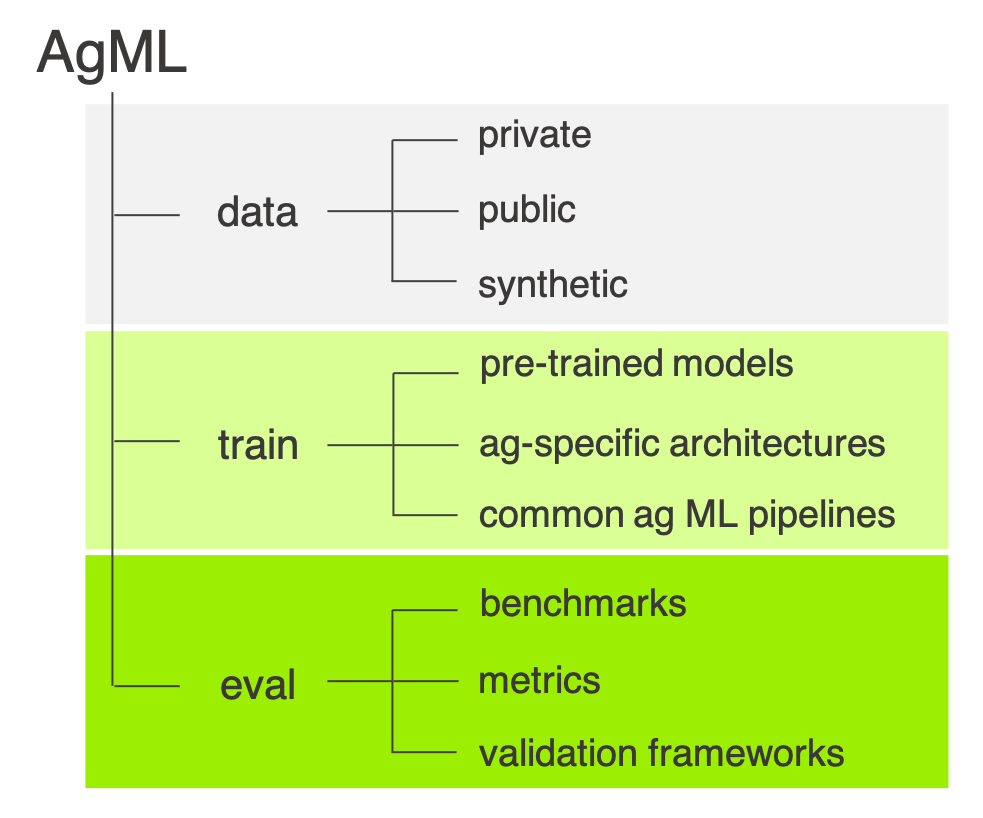

<p align="center">

</p>

----

### 👨🏿‍💻👩🏽‍💻🌈🪴 Want to join the [AI Institute for Food Systems team](https://aifs.ucdavis.edu/) and help lead AgML development? 🪴🌈👩🏼‍💻👨🏻‍💻

We're looking to hire a postdoc with both Python library development and ML experience. Send your resume and GitHub profile link to [jmearles@ucdavis.edu](mailto:jmearles@ucdavis.edu)!

----

## Overview
AgML is a comprehensive library for agricultural machine learning. Currently, AgML provides
access to a wealth of public agricultural datasets for common agricultural deep learning tasks. In the future, AgML will provide ag-specific ML functionality related to data, training, and evaluation. Here's a conceptual diagram of the overall framework.

<p align="center">

</p>

AgML supports both the [TensorFlow](https://www.tensorflow.org/) and [PyTorch](https://pytorch.org/) machine learning frameworks.

## Installation

To install the latest release of AgML, run the following command:

```shell
pip install agml
```

**_NOTE:_** Some features of AgML, such as synthetic data generation, require GUI applications. When running AgML through
Windows Subsystem for Linux (WSL), it may be necessary to configure your WSL environment to utilize these features. Please
follow the [Microsoft documentation](https://learn.microsoft.com/en-us/windows/wsl/tutorials/gui-apps) to install all
necessary prerequisites and update WSL. The latest version of WSL includes built-in support for running Linux GUI applications.

## Quick Start

AgML is designed for easy usage of agricultural data in a variety of formats. You can start off by using the `AgMLDataLoader` to
download and load a dataset into a container:

```python
import agml

loader = agml.data.AgMLDataLoader('apple_flower_segmentation')
```

You can then use the in-built processing methods to get the loader ready for your training and evaluation pipelines. This includes, but
is not limited to, batching data, shuffling data, splitting data into training, validation, and test sets, and applying transforms.

```python
import albumentations as A

# Batch the dataset into collections of 8 pieces of data:
loader.batch(8)

# Shuffle the data:
loader.shuffle()

# Apply transforms to the input images and output annotation masks:
loader.mask_to_channel_basis()
loader.transform(
    transform = A.RandomContrast(),
    dual_transform = A.Compose([A.RandomRotate90()])
)

# Split the data into train/val/test sets.
loader.split(train = 0.8, val = 0.1, test = 0.1)
```

The split datasets can be accessed using `loader.train_data`, `loader.val_data`, and `loader.test_data`. Any further processing applied to the
main loader will be applied to the split datasets, until the split attributes are accessed, at which point you need to apply processing independently
to each of the loaders. You can also turn toggle processing on and off using the `loader.eval()`, `loader.reset_preprocessing()`, and `loader.disable_preprocessing()`
methods.

You can visualize data using the `agml.viz` module, which supports multiple different types of visualization for different data types:

```python
# Disable processing and batching for the test data:
test_ds = loader.test_data
test_ds.batch(None)
test_ds.reset_prepreprocessing()

# Visualize the image and mask side-by-side:
agml.viz.visualize_image_and_mask(test_ds[0])

# Visualize the mask overlaid onto the image:
agml.viz.visualize_overlaid_masks(test_ds[0])
```

AgML supports both the TensorFlow and PyTorch libraries as backends, and provides functionality to export your loaders to native TensorFlow and PyTorch
formats when you want to use them in a training pipeline. This includes both exporting the `AgMLDataLoader` to a `tf.data.Dataset` or `torch.utils.data.DataLoader`,
but also internally converting data within the `AgMLDataLoader` itself, enabling access to its core functionality.


```python
# Export the loader as a `tf.data.Dataset`:
train_ds = loader.train_data.export_tensorflow()

# Convert to PyTorch tensors without exporting.
train_ds = loader.train_data
train_ds.as_torch_dataset()
```

You're now ready to use AgML for training your own models! Luckily, AgML comes with a training module that enables quick-start training of standard deep learning models on agricultural datasets. Training a grape detection model is as simple as the following code:

```python
import agml
import agml.models

import albumentations as A

loader = agml.data.AgMLDataLoader('grape_detection_californiaday')
loader.split(train = 0.8, val = 0.1, test = 0.1)
processor = agml.models.preprocessing.EfficientDetPreprocessor(
    image_size = 512, augmentation = [A.HorizontalFlip(p=0.5)]
)
loader.transform(processor)

model = agml.models.DetectionModel(num_classes=loader.num_classes)

model.run_training(loader)
```

## Public Dataset Listing

AgML contains a wide variety of public datasets from various locations across the world:


The following is a comprehensive list of all datasets available in AgML. For more information,
you can use `agml.data.public_data_sources(...)` with various filters to filter datasets according
to your desired specification.


| Dataset | Task | Number of Images |
| :--- | ---: | ---: |
[bean_disease_uganda](https://github.com/Project-AgML/AgML/blob/main/docs/datasets/bean_disease_uganda.md) | Image Classification | 1295 | 
[carrot_weeds_germany](https://github.com/Project-AgML/AgML/blob/main/docs/datasets/carrot_weeds_germany.md) | Semantic Segmentation | 60 | 
[plant_seedlings_aarhus](https://github.com/Project-AgML/AgML/blob/main/docs/datasets/plant_seedlings_aarhus.md) | Image Classification | 5539 | 
[soybean_weed_uav_brazil](https://github.com/Project-AgML/AgML/blob/main/docs/datasets/soybean_weed_uav_brazil.md) | Image Classification | 15336 | 
[sugarcane_damage_usa](https://github.com/Project-AgML/AgML/blob/main/docs/datasets/sugarcane_damage_usa.md) | Image Classification | 153 | 
[crop_weeds_greece](https://github.com/Project-AgML/AgML/blob/main/docs/datasets/crop_weeds_greece.md) | Image Classification | 508 | 
[sugarbeet_weed_segmentation](https://github.com/Project-AgML/AgML/blob/main/docs/datasets/sugarbeet_weed_segmentation.md) | Semantic Segmentation | 1931 | 
[rangeland_weeds_australia](https://github.com/Project-AgML/AgML/blob/main/docs/datasets/rangeland_weeds_australia.md) | Image Classification | 17509 | 
[fruit_detection_worldwide](https://github.com/Project-AgML/AgML/blob/main/docs/datasets/fruit_detection_worldwide.md) | Object Detection | 565 | 
[leaf_counting_denmark](https://github.com/Project-AgML/AgML/blob/main/docs/datasets/leaf_counting_denmark.md) | Image Classification | 9372 | 
[apple_detection_usa](https://github.com/Project-AgML/AgML/blob/main/docs/datasets/apple_detection_usa.md) | Object Detection | 2290 | 
[mango_detection_australia](https://github.com/Project-AgML/AgML/blob/main/docs/datasets/mango_detection_australia.md) | Object Detection | 1730 | 
[apple_flower_segmentation](https://github.com/Project-AgML/AgML/blob/main/docs/datasets/apple_flower_segmentation.md) | Semantic Segmentation | 148 | 
[apple_segmentation_minnesota](https://github.com/Project-AgML/AgML/blob/main/docs/datasets/apple_segmentation_minnesota.md) | Semantic Segmentation | 670 | 
[rice_seedling_segmentation](https://github.com/Project-AgML/AgML/blob/main/docs/datasets/rice_seedling_segmentation.md) | Semantic Segmentation | 224 | 
[plant_village_classification](https://github.com/Project-AgML/AgML/blob/main/docs/datasets/plant_village_classification.md) | Image Classification | 55448 | 
[autonomous_greenhouse_regression](https://github.com/Project-AgML/AgML/blob/main/docs/datasets/autonomous_greenhouse_regression.md) | Image Regression | 389 | 
[grape_detection_syntheticday](https://github.com/Project-AgML/AgML/blob/main/docs/datasets/grape_detection_syntheticday.md) | Object Detection | 448 | 
[grape_detection_californiaday](https://github.com/Project-AgML/AgML/blob/main/docs/datasets/grape_detection_californiaday.md) | Object Detection | 126 | 
[grape_detection_californianight](https://github.com/Project-AgML/AgML/blob/main/docs/datasets/grape_detection_californianight.md) | Object Detection | 150 | 
[guava_disease_pakistan](https://github.com/Project-AgML/AgML/blob/main/docs/datasets/guava_disease_pakistan.md) | Image Classification | 306 | 
[apple_detection_spain](https://github.com/Project-AgML/AgML/blob/main/docs/datasets/apple_detection_spain.md) | Object Detection | 967 | 
[apple_detection_drone_brazil](https://github.com/Project-AgML/AgML/blob/main/docs/datasets/apple_detection_drone_brazil.md) | Object Detection | 689 | 
[plant_doc_classification](https://github.com/Project-AgML/AgML/blob/main/docs/datasets/plant_doc_classification.md) | Image Classification | 2598 | 
[plant_doc_detection](https://github.com/Project-AgML/AgML/blob/main/docs/datasets/plant_doc_detection.md) | Object Detection | 2598 | 
[wheat_head_counting](https://github.com/Project-AgML/AgML/blob/main/docs/datasets/wheat_head_counting.md) | Object Detection | 6512 | 
[peachpear_flower_segmentation](https://github.com/Project-AgML/AgML/blob/main/docs/datasets/peachpear_flower_segmentation.md) | Semantic Segmentation | 42 | 
[red_grapes_and_leaves_segmentation](https://github.com/Project-AgML/AgML/blob/main/docs/datasets/red_grapes_and_leaves_segmentation.md) | Semantic Segmentation | 258 | 
[white_grapes_and_leaves_segmentation](https://github.com/Project-AgML/AgML/blob/main/docs/datasets/white_grapes_and_leaves_segmentation.md) | Semantic Segmentation | 273 | 
[ghai_romaine_detection](https://github.com/Project-AgML/AgML/blob/main/docs/datasets/ghai_romaine_detection.md) | Object Detection | 500 |
[ghai_green_cabbage_detection](https://github.com/Project-AgML/AgML/blob/main/docs/datasets/ghai_green_cabbage_detection.md) | Object Detection | 500 |
[ghai_iceberg_lettuce_detection](https://github.com/Project-AgML/AgML/blob/main/docs/datasets/ghai_iceberg_lettuce_detection.md) | Object Detection | 500 |
[riseholme_strawberry_classification_2021](https://github.com/Project-AgML/AgML/blob/main/docs/datasets/riseholme_strawberry_classification_2021.md) | Image Classification | 3520 |
[ghai_broccoli_detection](https://github.com/Project-AgML/AgML/blob/main/docs/datasets/ghai_broccoli_detection.md) | Object Detection | 500 |
[bean_synthetic_earlygrowth_aerial](https://github.com/Project-AgML/AgML/blob/main/docs/datasets/bean_synthetic_earlygrowth_aerial.md) | Semantic Segmentation | 2500 |
[ghai_strawberry_fruit_detection](https://github.com/Project-AgML/AgML/blob/main/docs/datasets/ghai_strawberry_fruit_detection.md) | Object Detection | 500 |
[vegann_multicrop_presence_segmentation](https://github.com/Project-AgML/AgML/blob/main/docs/datasets/vegann_multicrop_presence_segmentation.md) | Semantic Segmentation | 3775 |
[corn_maize_leaf_disease](https://github.com/Project-AgML/AgML/blob/main/docs/datasets/corn_maize_leaf_disease.md) | Image Classification | 4188 |
[tomato_leaf_disease](https://github.com/Project-AgML/AgML/blob/main/docs/datasets/tomato_leaf_disease.md) | Image Classification | 11000 |
[vine_virus_photo_dataset](https://github.com/Project-AgML/AgML/blob/main/docs/datasets/vine_virus_photo_dataset.md) | Image Classification | 3866 |
[tomato_ripeness_detection](https://github.com/Project-AgML/AgML/blob/main/docs/datasets/tomato_ripeness_detection.md) | Object Detection | 804 |
[embrapa_wgisd_grape_detection](https://github.com/Project-AgML/AgML/blob/main/docs/datasets/embrapa_wgisd_grape_detection.md) | Object Detection | 239 |
[growliflower_cauliflower_segmentation](https://github.com/Project-AgML/AgML/blob/main/docs/datasets/growliflower_cauliflower_segmentation.md) | Semantic Segmentation | 1542 |
[strawberry_detection_2023](https://github.com/Project-AgML/AgML/blob/main/docs/datasets/strawberry_detection_2023.md) | Object Detection | 204 |
[strawberry_detection_2022](https://github.com/Project-AgML/AgML/blob/main/docs/datasets/strawberry_detection_2022.md) | Object Detection | 175 |
[almond_harvest_2021](https://github.com/Project-AgML/AgML/blob/main/docs/datasets/almond_harvest_2021.md) | Object Detection | 50 |
[almond_bloom_2023](https://github.com/Project-AgML/AgML/blob/main/docs/datasets/almond_bloom_2023.md) | Object Detection | 100 |
[gemini_flower_detection_2022](https://github.com/Project-AgML/AgML/blob/main/docs/datasets/gemini_flower_detection_2022.md) | Object Detection | 134 |
[gemini_leaf_detection_2022](https://github.com/Project-AgML/AgML/blob/main/docs/datasets/gemini_leaf_detection_2022.md) | Object Detection | 25 |
[gemini_pod_detection_2022](https://github.com/Project-AgML/AgML/blob/main/docs/datasets/gemini_pod_detection_2022.md) | Object Detection | 98 |
[gemini_plant_detection_2022](https://github.com/Project-AgML/AgML/blob/main/docs/datasets/gemini_plant_detection_2022.md) | Object Detection | 402 |
[paddy_disease_classification](https://github.com/Project-AgML/AgML/blob/main/docs/datasets/paddy_disease_classification.md) | Image Classification | 10407 |
[onion_leaf_classification](https://github.com/Project-AgML/AgML/blob/main/docs/datasets/onion_leaf_classification.md) | Image Classification | 4502 |
[chilli_leaf_classification](https://github.com/Project-AgML/AgML/blob/main/docs/datasets/chilli_leaf_classification.md) | Image Classification | 10974 |
[orange_leaf_disease_classification](https://github.com/Project-AgML/AgML/blob/main/docs/datasets/orange_leaf_disease_classification.md) | Image Classification | 5813 |
[papaya_leaf_disease_classification](https://github.com/Project-AgML/AgML/blob/main/docs/datasets/papaya_leaf_disease_classification.md) | Image Classification | 2159 |
[blackgram_plant_leaf_disease_classification](https://github.com/Project-AgML/AgML/blob/main/docs/datasets/blackgram_plant_leaf_disease_classification.md) | Image Classification | 1007 |
[arabica_coffee_leaf_disease_classification](https://github.com/Project-AgML/AgML/blob/main/docs/datasets/arabica_coffee_leaf_disease_classification.md) | Image Classification | 58549 |
[banana_leaf_disease_classification](https://github.com/Project-AgML/AgML/blob/main/docs/datasets/banana_leaf_disease_classification.md) | Image Classification | 1288 |
[coconut_tree_disease_classification](https://github.com/Project-AgML/AgML/blob/main/docs/datasets/coconut_tree_disease_classification.md) | Image Classification | 5798 |
[rice_leaf_disease_classification](https://github.com/Project-AgML/AgML/blob/main/docs/datasets/rice_leaf_disease_classification.md) | Image Classification | 3829 |
[tea_leaf_disease_classification](https://github.com/Project-AgML/AgML/blob/main/docs/datasets/tea_leaf_disease_classification.md) | Image Classification | 5867 |
[betel_leaf_disease_classification](https://github.com/Project-AgML/AgML/blob/main/docs/datasets/betel_leaf_disease_classification.md) | Image Classification | 3589 |
[java_plum_leaf_disease_classification](https://github.com/Project-AgML/AgML/blob/main/docs/datasets/java_plum_leaf_disease_classification.md) | Image Classification | 2400 |
[sunflower_disease_classification](https://github.com/Project-AgML/AgML/blob/main/docs/datasets/sunflower_disease_classification.md) | Image Classification | 2358 |
[cucumber_disease_classification](https://github.com/Project-AgML/AgML/blob/main/docs/datasets/cucumber_disease_classification.md) | Image Classification | 7689 |
[iNatAg](https://github.com/Project-AgML/AgML/blob/main/docs/datasets/iNatAg.md) | Image Classification | 4720903 |
[iNatAg-mini](https://github.com/Project-AgML/AgML/blob/main/docs/datasets/iNatAg-mini.md) | Image Classification | 560844 |


## iNatAg and iNatAg-mini


AgML provides an API with direct access to iNatAg (and iNatAg-mini), one of the world's largest collections of agricultural images dedicated for the task of image classification. Collectively, this dataset contains over 4 million images along with detailed species classificaations and enables access to a variety of large-scale agricultural machine learning tasks. You can instantiate the iNatAg (or iNatAg-mini, a smaller variant of iNatAg for smaller-scale applications) dataset as follows:

```python
# To select a collection of scientific family names.
loader = agml.data.AgMLDataLoader.from_parent("iNatAg", filters={"family_name": ["...", "..."]})

# To select common names.
loader = agml.data.AgMLDataLoader.from_parent("iNatAg", filters={"common_name": "..."})
```

## Usage Information

### Using Public Agricultural Data

AgML aims to provide easy access to a range of existing public agricultural datasets The core of AgML's public data pipeline is
[`AgMLDataLoader`](/agml/data/loader.py). You can use the `AgMLDataLoader` or `agml.data.download_public_dataset()` to download
the dataset locally from which point it will be automatically loaded from the disk on future runs.
From this point, the data within the loader can be split into train/val/test sets, batched, have augmentations and transforms
applied, and be converted into a training-ready dataset (including batching, tensor conversion, and image formatting).

To see the various ways in which you can use AgML datasets in your training pipelines, check out
the [example notebook](/examples/AgML-Data.ipynb).

## Annotation Formats

A core aim of AgML is to provide datasets in a standardized format, enabling the synthesizing of multiple datasets
into a single training pipeline. To this end, we provide annotations in the following formats:

- **Image Classification**: Image-To-Label-Number
- **Object Detection**: [COCO JSON](https://cocodataset.org/#format-data)
- **Semantic Segmentation**: Dense Pixel-Wise

## Contributions

We welcome contributions! If you would like to contribute a new feature, fix an issue that you've noticed, or even just mention
a bug or feature that you would like to see implemented, please don't hesitate to use the *Issues* tab to bring it to our attention.

See the [contributing guidelines](/CONTRIBUTING.md) for more information.

## Funding
This project is partly funded by the [National AI Institute for Food Systems](https://aifs.ucdavis.edu).

