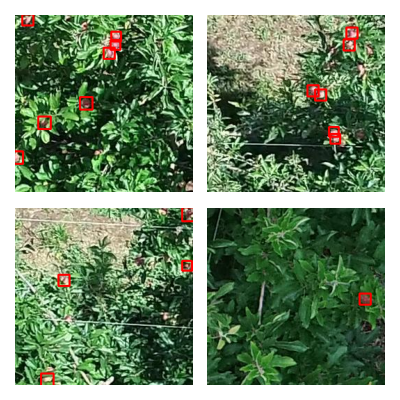

# `apple_detection_drone_brazil`

## Dataset Metadata

| Metadata | Value |
| --- | --- |
| **Classes** | apple |
| **Machine Learning Task** | object_detection |
| **Agricultural Task** | fruit_detection |
| **Location** | Brazil, South America |
| **Sensor Modality** | RGB |
| **Platform** | ground |
| **Input Data Format** | JPG |
| **Annotation Format** | coco_json |
| **Number of Images** | 689 |
| **Documentation** | https://github.com/thsant/add256/tree/zenodo-1.0 |
| **Stats/Mean** | [0.336, 0.482, 0.32] |
| **Stats/Standard Deviation** | [0.184, 0.187, 0.173] |

## Examples

