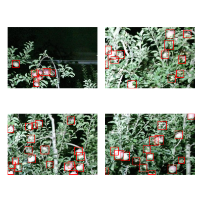

# `apple_detection_spain`

## Dataset Metadata

| Metadata | Value |
| --- | --- |
| **Classes** | apple |
| **Machine Learning Task** | object_detection |
| **Agricultural Task** | fruit_detection |
| **Location** | Spain, Europe |
| **Sensor Modality** | RGB |
| **Platform** | ground |
| **Input Data Format** | JPG |
| **Annotation Format** | coco_json |
| **Number of Images** | 967 |
| **Documentation** | https://www.grap.udl.cat/en/publications/KFuji_RGBDS_database.html |
| **Stats/Mean** | [0.375, 0.47, 0.393] |
| **Stats/Standard Deviation** | [0.272, 0.28, 0.283] |

## Examples

